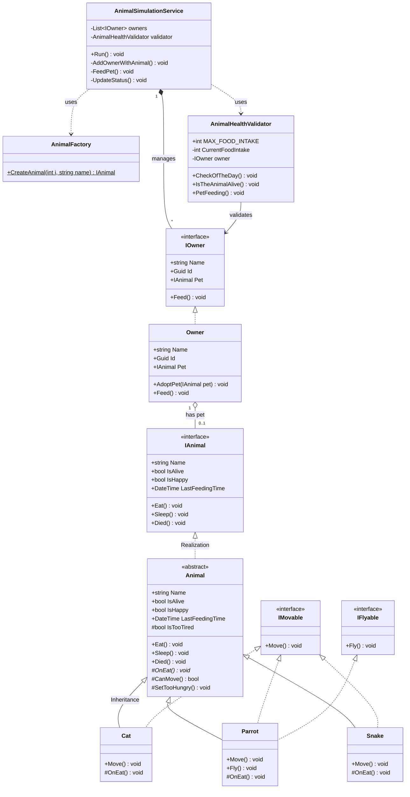

```mermaid
classDiagram
    %% Інтерфейси
    class IAnimal {
        <<interface>>
        +string Name
        +bool IsAlive
        +bool IsHappy
        +DateTime LastFeedingTime
        +Eat() void
        +Sleep() void
        +Died() void
    }

    class IOwner {
        <<interface>>
        +string Name
        +Guid Id
        +IAnimal Pet
        +Feed() void
    }

    class IMovable {
        <<interface>>
        +Move() void
    }

    class IFlyable {
        <<interface>>
        +Fly() void
    }

    %% Абстрактний клас
    class Animal {
        <<abstract>>
        +string Name
        +bool IsAlive
        +bool IsHappy
        +DateTime LastFeedingTime
        #bool IsTooTired
        +Eat() void
        +Sleep() void
        +Died() void
        #OnEat()* void
        #CanMove() bool
        #SetTooHungry() void
    }

    %% Конкретні класи
    class Cat {
        +Move() void
        #OnEat() void
    }

    class Parrot {
        +Move() void
        +Fly() void
        #OnEat() void
    }

    class Snake {
        +Move() void
        #OnEat() void
    }

    %% Сервісні класи
    class Owner {
        +string Name
        +Guid Id
        +IAnimal Pet
        +AdoptPet(IAnimal pet) void
        +Feed() void
    }

    class AnimalFactory {
        +CreateAnimal(int i, string name)$ IAnimal
    }

    class AnimalHealthValidator {
        +int MAX_FOOD_INTAKE
        -int CurrentFoodIntake
        -IOwner owner
        +CheckOfTheDay() void
        +IsTheAnimalAlive() void
        +PetFeeding() void
    }

    class AnimalSimulationService {
        -List~IOwner~ owners
        -AnimalHealthValidator validator
        +Run() void
        -AddOwnerWithAnimal() void
        -FeedPet() void
        -UpdateStatus() void
    }

    %% Зв'язки (Relationships)
    IAnimal <|.. Animal : Realization
    Animal <|-- Cat : Inheritance
    Animal <|-- Parrot
    Animal <|-- Snake

    IMovable <|.. Cat
    IMovable <|.. Parrot
    IFlyable <|.. Parrot
    IMovable <|.. Snake

    IOwner <|.. Owner
    Owner "1" o-- "0..1" IAnimal : has pet

    AnimalSimulationService "1" *-- "*" IOwner : manages
    AnimalSimulationService ..> AnimalFactory : uses
    AnimalSimulationService ..> AnimalHealthValidator : uses
    AnimalHealthValidator --> IOwner : validates
```
